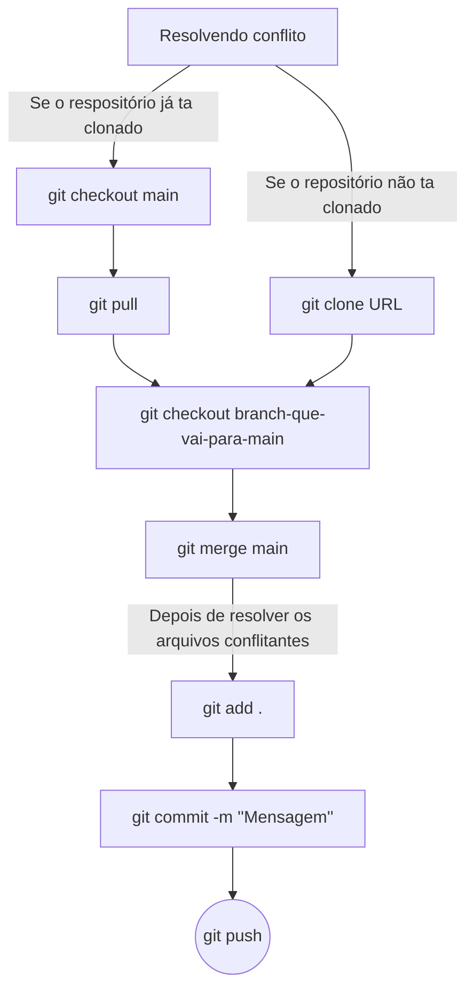

# Dummy Express
<a href="https://bit.ly/penpot-dummy-express">https://bit.ly/penpot-dummy-express</a>

# Repositórios
- [TODOS](https://github.com/orgs/gt-05/repositories)
- [GRUPO 01](https://github.com/gt-05/grupo-01)
- [GRUPO 02](https://github.com/gt-05/grupo-02)
- [GRUPO 03](https://github.com/gt-05/grupo-03)
- [GRUPO 04](https://github.com/gt-05/grupo-04)

# Sites para QA
- GRUPO 01 - [https://gt-05.github.io/grupo-01/](https://gt-05.github.io/grupo-01/)
- GRUPO 02 - [https://gt-05.github.io/grupo-02/](https://gt-05.github.io/grupo-02/)
- GRUPO 03 - [https://gt-05.github.io/grupo-03/](https://gt-05.github.io/grupo-03/)
- GRUPO 04 - [https://gt-05.github.io/grupo-04/](https://gt-05.github.io/grupo-04/)

# Quadros de tarefas
- GRUPO 01 - [https://github.com/orgs/gt-05/projects/17](https://github.com/orgs/gt-05/projects/17)
- GRUPO 02 - [https://github.com/orgs/gt-05/projects/14](https://github.com/orgs/gt-05/projects/14)
- GRUPO 03 - [https://github.com/orgs/gt-05/projects/19](https://github.com/orgs/gt-05/projects/19)
- GRUPO 04 - [https://github.com/orgs/gt-05/projects/16](https://github.com/orgs/gt-05/projects/16)

# Fluxo para resolver conflitos

